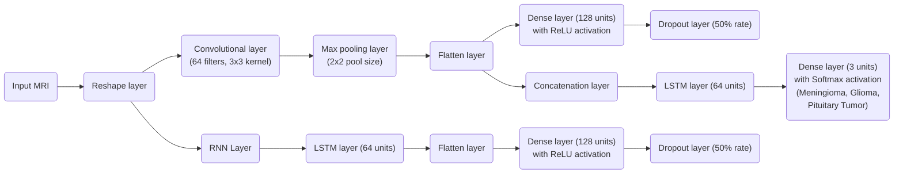

<h1 align="center">NeuroScan</h1>
 

A deep learning algorithm that uses CNN and RNN to detect a variety of brain tumors (including meningioma, glioma, and pituitary tumors). NeuroScan algorithmic optimizations are in development, along with the UI. Currently aiming to make AUC>=.9. AUC at ~.75 currently.

 

---

<h2>Architecture and Infrastructure</h2>

 

  
 

| Layer           | Height | Width | Depth | Filter Height | Filter Width | Nodes    |
|-----------------|--------|-------|-------|---------------|--------------|----------|
| Input MRI       | 256    | 256   | 1     | -             | -            | 1        |
| Reshape         | 256    | 256   | 1     | -             | -            | 1        |
| Convolutional   | 256    | 256   | 64    | 3             | 3            | 147,456  |
| Max Pooling     | 128    | 128   | 64    | 2             | 2            | 32,768   |
| Flatten         | -      | -     | 8192  | -             | -            | 8,192    |
| Dense           | -      | -     | 128   | -             | -            | 128      |
| Dropout         | -      | -     | 128   | -             | -            | 128      |
| RNN             | -      | -     | 8192  | -             | -            | 8,192    |
| LSTM            | -      | -     | 64    | -             | -            | 64       |
| Dense           | -      | -     | 128   | -             | -            | 128      |
| Dropout         | -      | -     | 128   | -             | -            | 128      |
| Concatenation   | -      | -     | 192   | -             | -            | 192      |
| LSTM            | -      | -     | 64    | -             | -            | 64       |
| Dense (Output)  | -      | -     | 3     | -             | -            | 3        |

*Table 1: Model layer summary*

    
To download **not-to-scale (see commit notes)** FCNN visual representation of NeuroScan's deep learning algorithm, click this link: 

[FCNN Visual Representation (ZIP File), Simplified (409 KB)](https://github.com/AbhiAlest/NeuroScan/blob/main/Predictions/Development/NeuroScan%20SVG%20(Simplified).zip)

---
  
<h2 >Installations and Dependencies</h2>

<h3 >Installations</h3>

Python
* NumPy
* OpenCV
* PIL (Python Imaging Library)
* BytesIO
* base64
* Flask

JavaScript
* TensorFlow
* axios
* React
* TypeScript
* Node.js
* Express.js
* Brain.js
* path
* body-parser
* cors

Go
* go.mongodb.org/mongo-driver/mongo
* gorilla/handlers
* gorilla/mux

<h3 >Dependencies</h3>

Python
* numpy: 'pip install numpy'
* tensorflow: 'pip install tensorflow'
* scikit-learn: 'pip install scikit-learn'
* keras: 'pip install keras'
* Pillow (Python Imaging Library): 'pip install Pillow'
* Flask: 'pip install Flask'
* opencv-python: 'pip install opencv-python'
* pymongo: 'pip install pymongo'

JavaScript
* axios: 'npm install axios'
* React: 'npx create-react-app my-app'
* TypeScript: 'npm install typescript'
* [Node.js](https://nodejs.org/en/download)
* Express.js: 'npm install express'
* cors: 'npm install cors'
* mongoose: 'npm install mongoose'
* multer: 'npm install multer'
* brain.js: 'npm install brain.js'
* body-parser: 'npm install body-parser'

Go
* gorilla/handlers: 'go get github.com/gorilla/handlers'
* gorilla/mux: 'go get github.com/gorilla/mux'

---
<h2 >Development and Production</h2>

Development
1. Clone the repository to your local machine.
2. Install the necessary dependencies by running 'npm install' (for Node.js) and 'pip install -r requirements.txt' (for Python), depending on the language you are using.
3. Start the React app/API server by running 'npm start' or 'python app.py' .
4. Start the React development server by running 'npm start' in the terminal. This should start a development server and open the app in your default browser.
5. Open your web browser and navigate to http://localhost:3000 to access the web app.

Note: If you are using Flask for the backend, you may need to set the environment variable 'FLASK_APP=app.py' before starting the server. Similarly, if you are using Node.js and Express, you may need to install nodemon and start the server using 'nodemon server.js' instead of 'node server.js'. Also, make sure to set the appropriate environment variables for connecting to any external services or databases that the app relies on.

Production (Flask)
1. Clone the repository to your production server.
2. Install the necessary dependencies using the appropriate package manager (npm install for Node.js packages, pip install for Python packages).
3. Build the React app by running npm run build in the terminal. This should create a production-ready build of the app in a build directory.
4. Start the Flask server in the background by running 'nohup python app.py &'. This should start the server and detach it from the terminal session so it can run in the background.
5. Use a process manager like systemd or supervisor to ensure the Flask server continues running in the background.
6. Set up a reverse proxy like nginx to serve the React app and forward API requests to the Flask server.
7. Ensure the server is configured to handle SSL/TLS encryption for secure communication.
8. Verify that the app is functioning correctly by accessing it through a web browser or other HTTP client.

---

  
 
    

